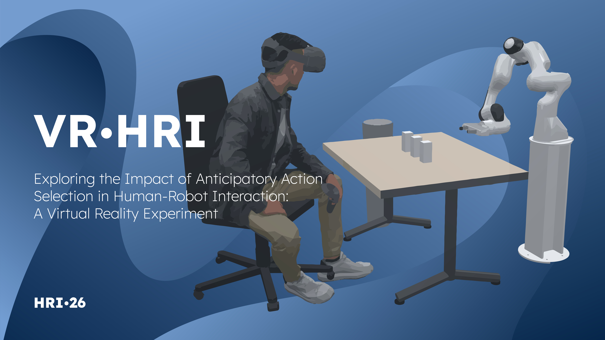
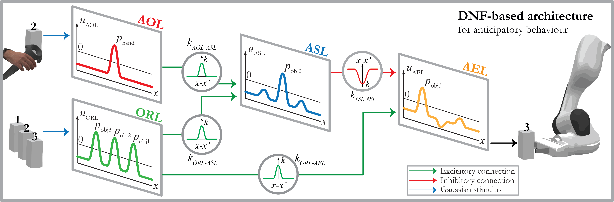

# Anticipatory Action Selection in Human-Robot Interaction



A virtual reality experiment exploring the impact of anticipatory behaviors in robots on joint task performance and human experience during collaborative pick-and-place tasks.

## Project Overview

This project implements a cognitive control system using dynamic neural field (DNF) architecture that enables a robot to predict and adapt to human actions in real-time. The system was evaluated in a virtual reality environment where participants completed a collaborative pick-and-place task with the robot under two conditions: anticipatory and non-anticipatory robot behavior.

### Key Findings

- Anticipatory mechanisms significantly improved subjective measures of robot perception
- Participants rated the anticipatory robot higher in competence and warmth
- Lower discomfort was reported when anticipation was enabled
- Significant reductions in collision frequency with anticipatory behavior
- Most participants (9/10) preferred collaborating with the anticipatory robot

## Project Structure

```
vr-hr-joint-task/ 
├── src/ # Source code 
│ ├── main.cpp # Main entry point 
│ ├── experiment.cpp # Experiment logic and control 
│ ├── dnf_architecture.cpp # DNF cognitive architecture 
│ ├── dnf_composer_handler.cpp # DNF framework interface 
│ ├── coppeliasim_handler.cpp # CoppeliaSim integration 
│ ├── event_logger.cpp # Data logging and analysis 
│ └── misc.cpp # Utility functions 
├── include/ # Header files 
├── coppeliasim/ # Simulation environment 
│ ├── scene.ttt # Main CoppeliaSim scene 
│ ├── scene-vr-lab.ttt # Alternative VR lab scene 
│ └── models/ # 3D models and assets 
├── resources/ # Additional resources 
├── build.bat # Build script 
└── CMakeLists.txt # CMake configuration
```


## System Architecture

### Core Components

1. **Experiment Controller** (`experiment.cpp`): Manages experiment flow, conditions, and data collection
2. **DNF Architecture** (`dnf_architecture.cpp`): Implements the cognitive control system with four neural fields
3. **CoppeliaSim Handler** (`coppeliasim_handler.cpp`): Interfaces with the robotics simulator
4. **DNF Composer Handler** (`dnf_composer_handler.cpp`): Manages the dynamic neural field framework
5. **Event Logger** (`event_logger.cpp`): Records and analyzes experimental data

### Cognitive Architecture

The project uses a dynamic neural field (DNF) architecture with four primary fields:
- **Action Observation Layer (AOL)**: Encodes the trajectory of the human hand
- **Object Representation Layer (ORL)**: Encodes objects in the workspace
- **Action Simulation Layer (ASL)**: Represents the robot's internal understanding of human intentions
- **Action Execution Layer (AEL)**: Encodes the robot's target actions



## Setup Requirements

### Hardware
- HTC VIVE or HTC VIVE Pro Eye VR headset (both tested and working)
- Controllers for interaction in VR environment
- Windows 11 (amd64) system

### Software Dependencies

#### Required Tools
1. **CMake** (version 3.20 or higher)
   - Download and install from [cmake.org](https://cmake.org/)

2. **vcpkg** (C++ package manager)
   ```bash
   git clone https://github.com/microsoft/vcpkg
   cd vcpkg
   .\bootstrap-vcpkg.bat
   ```
   - Set the `VCPKG_ROOT` environment variable to point to your vcpkg directory

3. **Visual Studio 2019/2022** with C++ development tools

#### Required Libraries

1. **Dynamic Neural Field Composer**
   - Implementation of the cognitive architecture based on dynamic neural fields
   - Repository: [github.com/Jgocunha/dynamic-neural-field-composer](https://github.com/Jgocunha/dynamic-neural-field-composer)
   - Installation:
     ```bash
     git clone https://github.com/Jgocunha/dynamic-neural-field-composer
     cd dynamic-neural-field-composer
     build.bat
     install.bat
     ```

2. **CoppeliaSim C++ Client**
   - Interface for communication with the CoppeliaSim robotics simulator
   - Repository: [github.com/Jgocunha/coppeliasim-cpp](https://github.com/Jgocunha/coppeliasim-cpp)
   - Installation:
     ```bash
     git clone https://github.com/Jgocunha/coppeliasim-cpp
     cd coppeliasim-cpp
     build.bat
     install.bat
     ```

3. **CoppeliaSim VR Toolbox**
   - Enables integration with VR headsets
   - Repository: [github.com/BorisBogaerts/CoppeliaSim-VR-Toolbox](https://github.com/BorisBogaerts/CoppeliaSim-VR-Toolbox)
   - Installation:
     1. Download the latest release (CoppeliaSim VR Toolbox 2.2)
     2. Run the installer
     3. Navigate to the installation directory
     4. Open `Scripts/HTC_VIVE.lua`
     5. Comment line 40 and uncomment line 41:
        ```lua
        -- Line 40: Comment this line
        --simpleShapeHandles=sim.ungroupShape(handles[i])
        -- Line 41: Uncomment this line
        simpleShapeHandles = {handles[i]}
        ```
     6. Run `copyToVrep.bat` as administrator

#### Automatically Managed Dependencies
The following libraries are automatically installed via vcpkg during the build process:
- imgui (with docking-experimental, core, dx12-binding, win32-binding)
- implot
- nlohmann-json

## Building the Project

1. **Clone the repository**
   ```bash
   git clone [repository-url]
   cd vr-hr-joint-task
   ```

2. **Ensure all dependencies are installed** (see Setup Requirements)

3. **Build the project**
   ```bash
   build.bat
   ```
   This script will:
   - Configure CMake
   - Install necessary vcpkg packages
   - Compile the project
   - Generate the executable

## Running the Experiment

1. **Start CoppeliaSim** and open the scene:
   - Open `coppeliasim/scene.ttt` (main scene) or
   - Open `coppeliasim/scene-vr-lab.ttt` (alternative VR lab scene)

2. **Launch the application**:
   ```bash
   .\cmake-build-debug\vr-hr-joint-task-exe.exe
   ```

3. **Start the simulation** in CoppeliaSim (press the play button)

4. **Put on the VR headset** to begin the experiment

## Experiment Design

The experiment employs a within-subjects design with two conditions:

### Conditions
- **Anticipation-on**: Robot exhibits anticipatory behavior by predicting the participant's next action using the DNF architecture
- **Anticipation-off**: Robot selects objects arbitrarily with no predictive behavior

### Task
In each trial, the participant and robot collaboratively place three objects into a container. The system automatically logs:
- Task completion times
- Collision frequencies
- Movement trajectories
- Subjective ratings (post-experiment questionnaires)

### Data Collection
All experimental data is automatically logged by the `event_logger` component, including:
- Temporal data of human and robot actions
- Spatial trajectories
- Task performance metrics
- System state information

## Troubleshooting

### Common Issues

1. **VR Toolbox crashes on first launch**
   - This is expected behavior; the toolbox typically works fine on subsequent launches

2. **Broken models in VR simulation**
   - Ensure the lua file modification was applied correctly
   - Alternative fix: Run simulation → Stop → Press Ctrl+Z to undo → Save (Ctrl+S)

3. **Build failures**
   - Verify all dependencies are properly installed
   - Check that `VCPKG_ROOT` environment variable is set correctly
   - Ensure Visual Studio C++ tools are installed

4. **VR headset not detected**
   - Verify VR Toolbox installation
   - Check that SteamVR or OpenVR is properly configured
   - Ensure VR headset drivers are up to date
